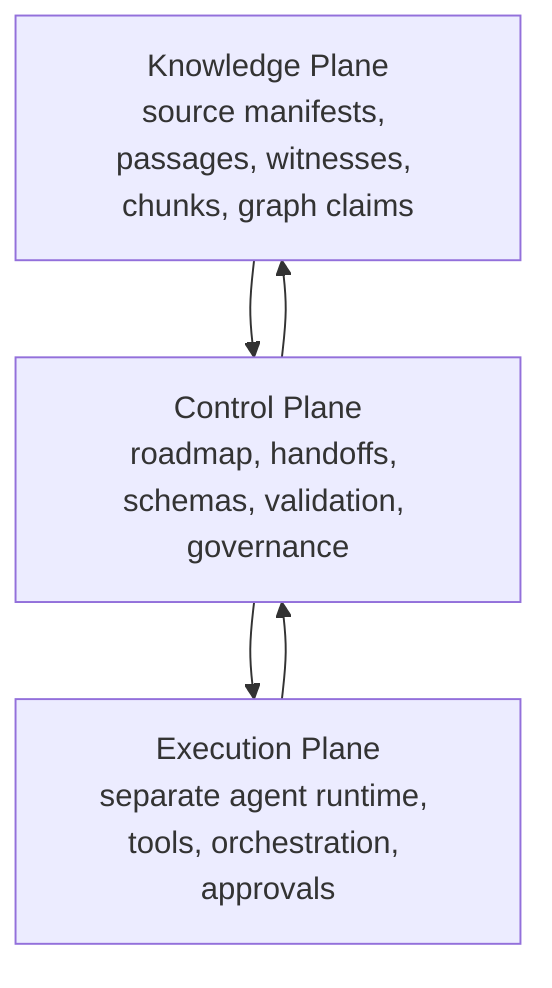

# Architecture

## System boundary

This repository is the **knowledge plane** and semantic control plane for the Bible graph. It owns source manifests, canonical passage identity, translation witnesses, boundary claims, chunk policies, schemas, validation, and release artifacts.

The future agent runtime should be separate. It may read this repo, run pipelines, propose changes, and consume release artifacts, but it should not become the source of truth.

## Three-plane model



## Canonical vs derived

| Layer | Examples | Rule |
|---|---|---|
| Raw source | `eng-web_usfm.zip`, WLC files, Greek NT files | Immutable; never hand edit. |
| Canonical model | `ScripturePassage`, `TranslationWitness`, source manifests | Generated or curated with provenance. |
| Derived evidence | chunks, embeddings, indexes, context packets | Rebuildable; never treated as canonical source. |
| Claims/edges | cross-references, theme links, doctrine links | Asserted/inferred separation required. |
| Runtime artifacts | retrieval traces, answers, agent logs | Separate from canonical truth. |

## Source identity model

```text
ScriptureWork
  -> ScripturePassage
     -> TranslationWitness
        -> TextSpan
           -> BoundaryClaim
              -> RetrievalChunk
                 -> ContextPacket
```

## Relationship model

Important relationships are first-class objects when they need metadata:

```text
RelationshipObject:
  subject_id
  predicate
  object_id
  evidence_refs
  provenance
  confidence
  assertion_mode: asserted | inferred | candidate
  trust_zone
```

## Trust zones

| Zone | Purpose |
|---|---|
| raw | untouched source artifacts |
| canonical | passage registry, source manifests, translation witness records |
| asserted | human-reviewed edges/claims |
| inferred | rebuildable machine-derived closure/inference |
| candidate | AI- or bulk-import-suggested claims pending review |
| derived | chunks, embeddings, search indexes |

## Build flow

```text
raw source drop
  -> source manifest
  -> parser/importer
  -> canonical passage registry
  -> text spans and translation witnesses
  -> boundary claims
  -> retrieval chunks and context packets
  -> graph claims / relationship objects
  -> indexes and release artifacts
```
