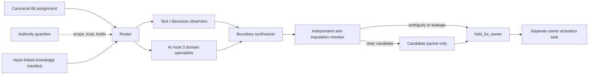

# T500 Scripture-First Biblical Chunking Expert Family

## Outcome

T500 creates the governed `scripture-first-biblical-chunking` family in Logos. The family covers
all 19 canonical literary forms currently registered for the 66-book corpus, with seven control
roles, eight campaign roles, three shared observational roles, and fourteen specialist packs. It emits only candidate
packets and holds. It changes no chunk, reviewed gold, route, evaluator, canon, graph, retrieval,
reading, source tradition, doctrine, or theology authority.

The owner-authorized principle already exists in
`.ai/control/t468_owner_faithful_chunking_policy.yaml`: let the Bible interpret the Bible wherever
reasonably possible, preserve coherent literary and discourse units, and defer hot zones to
transparent packets. T500 instantiates that authority; it does not create or enlarge it.

## Governed flow

One writer and a distinct checker are required. Delegation depth is one. A router may activate no
more than three domain specialists, and only from marker-evidenced form, risk, language, and
canonical-cross-witness inputs. Book genre is a prior, never sufficient routing evidence.

## Bible-wide campaign foundation

Biblical names are display identities only. They confer no spiritual, textual, theological, or
decision authority. The campaign roles are Bezalel (harness and marker observation), Nehemiah
(foreman), Ezra (parent literary units), Jethro (child necessity), Nathan (anti-imputation),
Gamaliel (bounded evidence disputes), and Esther (human docket). Jeremiah handles textual-witness
evidence, John handles speaker ambiguity, Joshua guards reviewed-gold comparisons, and Caleb
calibrates historical model maps.

Parent literary units are always proposed first. Child review defaults to `no_children`, requires
an existing parent, and must remain contained in the same lane. T500 states those invariants; T512
owns collection-level referential and containment enforcement. Historical model maps are evidence
only, receive no vote or authority, and M1/M5 are explicitly retained as mechanical outliers.

## Evidence constitution

Evidence is ordered and cannot be collapsed:

1. Exact canonical text and structural markers, including approved Hebrew/Greek structural observations.
2. Immediate discourse, paragraph, chapter, and whole-book context.
3. Explicit canonical quotations, parallel accounts, and clear authorial callbacks.
4. Strong repeated formulations or lexical/syntactic echoes as support only.
5. Thematic similarity as candidate-only evidence that cannot drive a boundary.

Commentaries, creeds, systematic theology, denominational outlines, modern headings, and historical
reconstructions are rejected from the Scripture-only first pass. Verified historical context has a
separate non-authorizing lane. Hebrew and Greek evidence cannot select doctrine, translation,
preferred readings, source traditions, or boundaries.

## Authoritative locations

- Family, role, knowledge, routing, pilot, and release contracts:
  `config/agents/families/scripture-first-biblical-chunking/`
- Versioned schemas: `schemas/*biblical-chunking*.schema.json` and
  `schemas/scripture-first-biblical-chunking-family.schema.json`
- Generated hash catalog, reverse dependencies, pilot preflight, whole-Bible shadow, and portable
  DAD candidate: `config/agents/families/scripture-first-biblical-chunking/generated/`
- Deterministic builder: `scripts/build_scripture_first_biblical_chunking_catalog.py`
- Fail-closed validator: `scripts/validate_scripture_first_biblical_chunking_family.py`
- Contract fixtures: `tests/fixtures/scripture_first_biblical_chunking_family/`

The knowledge manifest points to Logos authority; it does not duplicate that content. Existing
chunking skills retain their lifecycle and locations. The approved monolith remains the fallback.
Existing `chunking_architect`, `biblical_literature_reviewer`, `hebrew_reviewer`, and
`greek_reviewer` roles are retained and receive candidate-only compatibility aliases.

## BCF gate status

The collision-free T500-T510 block is reserved as the stable workstream mapping below. T500 was the
integration carrier for the foundation; T501-T510 remain reserved identifiers and become standalone
task records only when their separately gated lane is opened.

| Workstream | T-series ID | T500 result | Gate |
| --- | --- | --- | --- |
| BCF-01 authority and constitution | T500 | Existing T468/CD-107 authority encoded; no upstream proposal needed | Implemented |
| BCF-02 contracts | T501 | Four strict Draft 2020-12 contracts plus positive/negative fixtures | Implemented in foundation |
| BCF-03 knowledge catalog | T502 | 29 pointer-only records, hashes, deterministic catalog, reverse map | Implemented in foundation |
| BCF-04 core observational agents | T503 | Profiles and packet contracts exist; no runtime candidate execution | Candidate contract ready |
| BCF-05 Hebrew Bible packs | T504 | Seven requested HB/form/language pack capabilities represented | Candidate contract ready |
| BCF-06 New Testament packs | T505 | Gospel, Acts, epistle, apocalyptic, Greek, quotation/parallel capabilities represented | Candidate contract ready |
| BCF-07 routing and compatibility | T506 | All 19 canonical forms route; front matter/early-church rows reject or exclude; monolith fallback preserved | Implemented in foundation |
| BCF-08 controlled pilots | T507 | Fifteen-case routing preflight exists; John 3 and 1 Cor 8-10 hold | Exegetical run held |
| BCF-09 whole-Bible shadow | T508 | All 31,103 passages and 66 books accounted from no-text metadata | Boundary trial held |
| BCF-10 DAD adaptation | T509 | Hash-linked, payload-free local candidate generated | Publication ineligible |
| BCF-11 activation | T510 | No activation packet or incumbent replacement | Separate Lowell approval required |

## Why BCF-08 and BCF-09 remain held

The deterministic preflight proves case coverage, scope, routing contracts, holds, and zero output
changes. It does not claim to have read Scripture or generated exegetical alternatives. The
whole-Bible coverage inventory lacks the marker-evidenced form observations required to activate a
specialist. T475 also remains `HOLD_WITH_FINDINGS` because three heading-embedded footnotes need
typed-sidecar preservation. Inventing boundaries from book genre or stale marker ownership would
violate the family constitution.

The independent Scripture-first checker accepted the candidate foundation after adversarial repair.
Before any execution pilot, run-level orchestration must additionally resolve every child packet's
`parent_assignment_packet_id` and verify that parent and child lanes match. The V1 single-packet
contract requires the reference but does not claim cross-packet referential resolution has run.

The next authorized execution task is therefore a candidate-only controlled pilot after the T475
source-integrity blocker is resolved. That task must freeze inputs, run one writer and a distinct
checker, preserve reviewed identity, and retain unresolved alternatives. Only after that passes may
a marker-evidenced 66-book boundary shadow run.

## DAD and activation gates

The local generated DAD candidate contains only contracts, paths, hashes, capability names, and
hold reasons. It contains no Scripture text, source rows, private conversations, secrets, or Logos
authority. Publication is correctly blocked because DAD's candidate family framework is not merged,
its portfolio documentation/registry count drift is unresolved, and Logos pilots/shadow have not
passed. DAD may never override Logos governance or write/push into Logos.

Activation remains a separate owner decision. T500 cannot replace the incumbent, promote gold, or
turn any candidate into active output.
